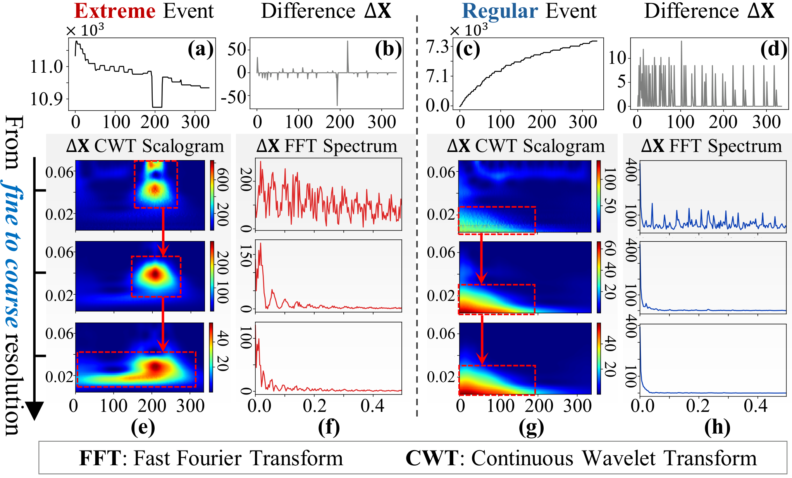
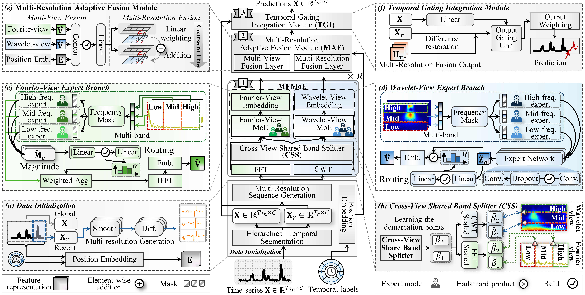

# M$^2$FMoE: Multi-Resolution Multi-View Frequency Mixture-of-Experts for Extreme-Adaptive Time Series Forecasting

## Motivation




Frequency-domain representations provide an effective way to decompose temporal dynamics into spectral components, separating high-frequency fluctuations from low-frequency trends.

As illustrated in **Fig. 1(a)–(d)**, the differenced sequences $\Delta\mathbf{X}$ show clear contrasts between extreme and regular events. These differences are amplified in the wavelet domain (**Fig. 1(e), (g)**), where extreme events yield sharp, localized energy at fine resolutions; as the resolution becomes coarser, energy shifts toward lower frequencies with reduced intensity while the event structure remains consistent. In contrast, regular events exhibit smooth low-frequency dynamics, producing diffuse and uniform energy across resolutions. Similar patterns appear in the Fourier domain (**Fig. 1(f), (h)**): extreme sequences show broad-spectrum, multi-peaked energy with slow spectral decay, whereas regular sequences concentrate energy within narrow low-frequency bands.

## Model Architecture



## Acknowledgements
We thank the authors of the following repositories for their open-source code or datasets used in our experiments:

- MC-ANN: https://github.com/davidanastasiu/mcann  
- FreqMoE: https://github.com/sunbus100/FreqMoE-main
- Time-Series-Library: https://github.com/thuml/Time-Series-Library  
- MoLE: https://github.com/RogerNi/MoLE  

## Datasets
Datasets can be found in the MC-ANN repository:  
https://github.com/davidanastasiu/mcann

## Citation
If you find this work useful, please cite:

```bibtex
@inproceedings{huang2026m2fmoe_aaai,
  title     = {M$^2$FMoE: Multi-Resolution Multi-View Frequency Mixture-of-Experts for Extreme-Adaptive Time Series Forecasting},
  author    = {Yaohui Huang and Runmin Zou and Yun Wang and Laeeq Aslam and Ruipeng Dong},
  booktitle = {Proceedings of the 40th AAAI Conference on Artificial Intelligence},
  year      = {2026}
}

@misc{huang2026m2fmoe_arxiv,
  title         = {M$^2$FMoE: Multi-Resolution Multi-View Frequency Mixture-of-Experts for Extreme-Adaptive Time Series Forecasting},
  author        = {Yaohui Huang and Runmin Zou and Yun Wang and Laeeq Aslam and Ruipeng Dong},
  year          = {2026},
  eprint        = {2601.08631},
  archivePrefix = {arXiv},
  primaryClass  = {cs.LG},
  url           = {https://arxiv.org/abs/2601.08631}
}
